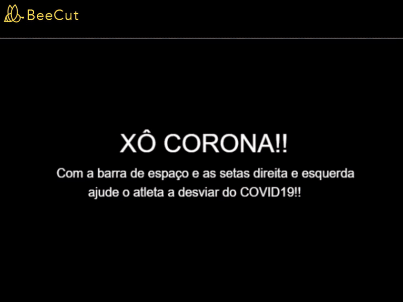
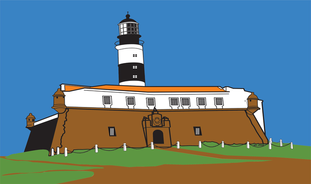
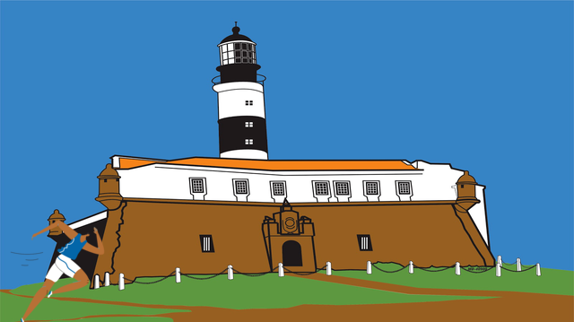
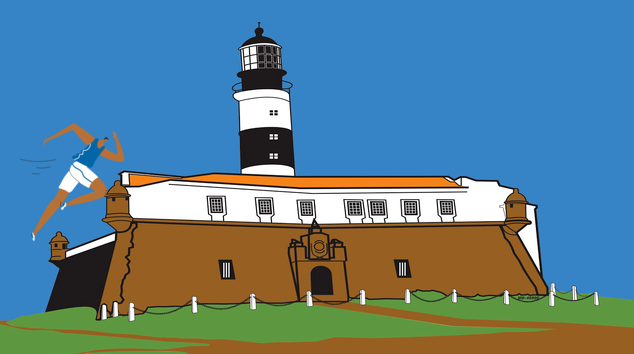
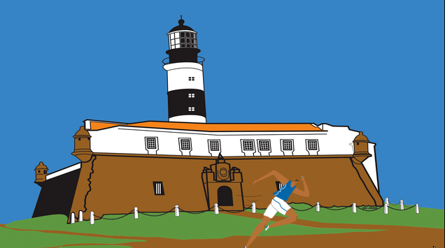
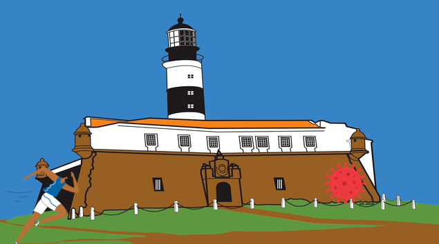
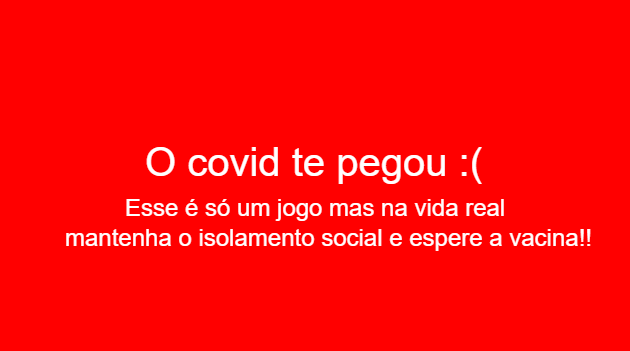
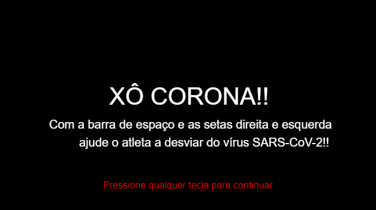

# Tutorial: jogo Xô Corona





**Autores**: Equipe 4

**Conhecimento prévio necessário**: Estruturas de seleção (if/else), estrutura de repetição (while) e variáveis. 

**Objetivo de aprendizagem**: a partir deste tutorial, o estudante deverá ser capaz de compreender a estrutura de repetição `while`, os diferentes tipos de variáveis, principalmente as do tipo `bool`. O estudante deverá ser capaz de acrescer outros obstáculos e ou vantagens para o personagem de acordo com o que o problema pede. 

## Iniciando

Neste tutorial você vai aprender a desenvolver um jogo com estilo de aventura chamado `Xô Corona`, cujo objetivo é guiar o <s>histórico de</s> atleta de forma que ele não seja atingido pelo vírus SARS-CoV-2.


## Carregando as imagens

Primeiramente vamos carregar as imagens que vamos usar no jogo: o background, o vírus e o atleta. Para isso, vamos usar a função `loadImage`. Depois disso vamos colocar o background na posição (0, 0) - canto superior esquerdo da tela - usando a função `drawImage`:

```cpp
#include <inge9>
int main() {
  
  loadImage("background", "https://raw.githubusercontent.com/renaderibeiro/XoCorona/main/Imagens/background.png");
  loadImage("atleta", "https://raw.githubusercontent.com/renaderibeiro/XoCorona/main/Imagens/atleta.png");
  loadImage("virus", "https://raw.githubusercontent.com/renaderibeiro/XoCorona/main/Imagens/virus.png");
  waitUntilResourcesLoad();
  
  drawImage("background", 0, 0);
  
  return 0;
}
```

Usamos a função `waitUntilResourcesLoad` que aguarda até que todas as imagens sejam carregadas antes de continuar a execução do programa.




## Desenhando o atleta

Precisamos criar uma variável chamada `atletaY` para determinar se o atleta está em cima ou embaixo, usaremos `0` para embaixo e `1` para em cima. Vamos usar a estrutura de seleção `if` para desenhar o atleta em cima ou embaixo. Na função `drawImage`, o primeiro número representa a coordenada `x`, a largura, e o segundo número representa a coordenada `y`, a altura.

```cpp
#include <inge9>
int main() {
  int posicao = 0;

  // código anterior omitido...
  
  drawImage("background", 0, 0);
  
  if (atletaY == 0) {
    drawImage("atleta", 0, 240);
  } else {
    drawImage("atleta", 0, 120);
  }

  return 0;
}
```




## Controlando o atleta

Neste jogo teremos três formas de controlar o personagem: a `barra de espaço`, a `->` e a `<-`. Quando o jogador pressionar `Espaço`, o atleta se move para cima. Quando o jogador pressionar `->` ele se moverá para direita e quando pressionar `<-` ele se moverá para a esquerda. Para isso, vamos criar um loop infinito para que possamos identificar se o jogador pressionou alguma dessas teclas, assim podemos alterar a posicao do personagem.


### Alterando a posicao do personagem (vertical)

Para alterar a posicao do personagem para cima e para baixo, vamos usar o seguinte código: `atletaY = 1 - atletaY;`. Desta forma, se `atletaY` for `0`, vai se tornar `1` e se for `1` se tornará `0`.

```cpp
#include <inge9>
int main() {

  // código anterior omitido...
  loadImage(...);
  
  while (true) {
    // processando teclas
    if (isKeyDown(" ")) {
	    atletaY = 1 - atletaY;
      clearKey(" "); 
    }
    
    // desenha
    drawImage("background", 0, 0);
    if (atletaY == 0) {
      drawImage("atleta", 0, 240);
    } else {
      drawImage("atleta", 0, 120);
    }


    //aguarda
    delay(30);
  }

  return 0;
}
```




Para verificar se o usuário pressionou alguma das teclas usamos a função `isKeyDown`, passando como parâmetro uma string composta de um espaço em branco para `Espaço`.

  * No caso de `Espaço` pressionada, desenhamos o personagem um pouco acima (alterando a altura de 240 para 120).

A seguir limpamos a informação de leitura com `clearKey`) para que o programa possa ler outra tecla pressionada pelo usuário posteriormente.

Ao final do loop é necessário aguardar um tempo. Usamos a função `delay` que recebe como parâmetro um número como milissegundos.


### Alterando a posicao do personagem (horizontal)

Para alterar a posicao do personagem para a direita e a esquerda, precisamos primeiro entender que queremos que o personagem caminhe por toda a tela. Portanto o valor da coordenada x para o desenho do personagem não deve ser fixo e sim variável.

Iremos criar a variável `atletaX` para guardar o valor da coordenada X do atleta e substituíla no local onde estava o número 0 - anterior posição fixa horizontal do atleta:

```cpp
#include <inge9>
int main() {
  int atletaY = 0;
  int atletaX = 0;
  
  //carregando imagens 
  
  while (true) {
    // processando teclas
    
    // desenha
    drawImage("background", 0, 0);
    if (atletaY == 0) {
      drawImage("atleta", atletaX, 240);
    } else {
      drawImage("atleta", atletaX, 120);
    }
  
    // aguarda
  }

  return 0;
}

```

Para alterar o valor de `atletaX` devemos ler as teclas `->` ou `<-` pressionadas e adicionar ou diminuir valores da varável:

```cpp
#include <inge9>
int main() {
  //codigo anterior omitido
  
  while (true) {
    // processa teclas
    if (isKeyDown(" ")) {
	    atletaY = 1 - atletaY;
      clearKey(" ");
    }
    
    if (isKeyDown("ArrowLeft")) atletaX -=3;
    if (isKeyDown("ArrowRight")) atletaX +=3;
    
    // desenha
    
    // aguarda
    delay(30);
  }
  return 0;
}
```




Para verificar se o usuário pressionou alguma das teclas usamos duas vezes a função `isKeyDown`, passando como parâmetro uma string composta de `ArrowLeft` e outra composta por `ArrowRight`.

  * No caso de `->` pressionada, aumentamos em 3 o número de `atletaX` movendo o personagem para direita.

  * No caso de `<-` pressionada, diminuimos em 3 o número de `atletaX` movendo o personagem para esquerda.


## Adicionando o vírus

O vírus aparece no canto direito da tela (embaixo ou em cima) e se movimenta em direção ao canto esquerdo da tela com velocidade constante. Para guardar o valor do vírus e onde ele está localizado precisamos de duas variáveis. Serão elas: `virusY` e `virusX`. A cada iteração do loop infinito, `virusX` diminui afim de atingir o atleta. A posicao inicial do Virus é 600 para que ele venha do canto direito da tela e vá diminuindo seu valor até chegar ao atleta.

```cpp
#include <inge9>
int main() {
  // ...
  int virusY = 0;
  int virusX = 600;
  
  // ...

  while (true) {
    // processa teclas
    // ...
    
    if (isKeyDown("ArrowRight")) atletaX +=3;
    
    virusX -= 4;
    // desenha
    drawImage("background", 0, 0);
    if (virusY == 0) {
      drawImage("virus", virusX, 240);
    } else {
      drawImage("virus", virusX, 120);
    }
    //desenha posicao atleta
    // ...
  }
  
  return 0;
}
```




## Sendo atingido pelo vírus

Para que possamos perder o jogo devemos checar se o atleta é atingido pelo vírus. Para isso precisamos considerar as dimensões do atleta -- 128 de largura x 128 de altura -- e do vírus -- 60 de largura x 60 de altura. Para isso iremos criar uma variável chamada `gameOver` para marcar o fim do jogo. O loop deixa de ser infinito e tudo que está dentro dele apenas irá acontecer enquanto essa variável tiver o valor `false`:

```cpp
#include <inge9>
int main() {
  bool gameOver = false;
  
  // carregando imagens 
  while (!gameOver) {

    // ...
    
    // desenha 

    // verifica se o atleta foi atingido
    if (atletaY == VirusY && atletaX <= virusX + 60 && atletaX + 128 >= virusX) {
      gameOver = true;
    }
    
    // aguarda
    delay(30);
  }

  //mensagem de fim de jogo
  clear("red");
  drawText("O covid te pegou :(",100, 180, 40, "white");
  drawText("Esse é só um jogo mas na vida real", 130, 220, 24, "white");
  drawText("mantenha o isolamento social e espere a vacina!! ", 70, 250, 24, "white");
  
  
  return 0;
}
```




Detalhando o código:

* Se atletaY for igual VirusY, ambos estão ou em cima ou embaixo
* Se atletaX for menor ou igual a virusX + 60 (a largura do vírus), o atleta acabou de atingir ou está atingindo o vírus
* Se atletaX + 128 (a largura do atleta) for maior ou igual a virusX, o atleta acabou de atingir ou está atingindo o vírus
* Se isso ocorrer `gameOver` se torna `true` e saímos do loop. A seguir temos a impressão da mensagem de fim de jogo 


## Gerando vários vírus

Até agora só desenhamos um vírus na tela mas para que o jogo fique mais divertido e dinâmico iremos acrescer um código que gera vários vírus. Para isso usaremos as funções `srand` e `time` para gerar um tempo aleatório para os vírus. Para usarmos essas funções devemos incluir as bibliotecas `cstdlib` e `ctime`.

```cpp
#include <inge9>
#include <ctime>
#include <cstdlib>

int main() {
  // ...
  srand(time(0));

  loadImage(); // ...
  
  while (!gameOver) {
    // ....
    
    // verifica colisão
    
    // cria novo obstáculo se necessário
    if (virusX < 0) {
      virusY = rand() % 2;
      virusX = 600;
    }
    
    // aguarda
    delay(30);
  }

  //...

  return 0;
}
```
Detalhando o código:

* Se virusX for menor ou igual a 0 quer dizer que o vírus já não pode mais atingir o atleta, então faz sentido gerar outro vírus
* Para que o vírus seja gerado de forma aleatória em cima ou embaixo usamos a `rand() % 2` escolhe aleatoriamente o valor de 0 ou 1 para a variável `virusY`
* Repetimos o valor de 600 para `virusX` para que o vírus sempre venha do canto direito da tela


## Mensagem do início de jogo

Para finalizar nosso jogo iremos criar uma tela inicial para explicar para como o jogo funciona:

```cpp
#include <inge9>
#include <ctime>
#include <cstdlib>

int main() {
  // ...
  loadImage(...);
  
  clear("black");
  drawText("XÔ CORONA!!",190, 180, 40, "white");
  drawText("Com a barra de espaço e as setas direita e esquerda", 90, 220, 20, "white");
  drawText("ajude o atleta a desviar do vírus SARS-CoV-2!! ", 140, 250, 20, "white");
  drawText("Pressione qualquer tecla para continuar", 180, 320, 16, "red");
  
  readKey()
  
  while (!gameOver) {
    //...
  }
  
  return 0;
}
```



Utilizamos o readKey() para que o programa espere até que qualquer letra seja pressionada para continuar o jogo.


## Aumentando a dificuldade

### Exercício: A vacina

Agora é com você! Modifique o código acrescendo vacinas no código:

```cpp
#include <inge9>
int main() {
  //...
  loadImage("vacina", "https://raw.githubusercontent.com/renaderibeiro/XoCorona/main/Imagens/vacina.png");
  
  //...
}
```

Você deve acrescer a vacina de modo que apareça uma vacina a cada 10 vírus.

Ao coletar uma vacina a velocidade com a qual o vírus se move deve aumentar de -4 para -12.

Ao coletar duas vacinas o jogo termina e o jogador vence o jogo!!

### Curiosidade

É possível utilizar o conceito de vetores para dinamizar o surgimento dos vírus!!
